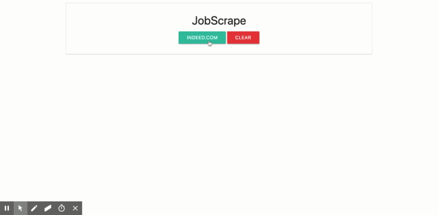

# JobScrape

## Description

JobScrape is a tool for helping developers on their job search by fetching job postings from websites such as Indeed, Monster and Glassdoor.

Under development include a login system where the user will be able to have their own list of jobs saved and the option to export the list as a spreadsheet.

## Live Preview

-   [JobScrape](https://jobscrape.herokuapp.com/)

## Author(s)

-   [Weslley Braga](https://github.com/wesbragagt)

## Technologies Used

### Front-end

-   Materialize
-   AJAX
-   JQuery
-   Handlebars

### Back-end

-   Nodejs
-   Express
-   Mongoose

### Database

-   MongoDb
-   mLab

### Deployment

-   Heroku

---

## License & Copyright

© Weslley Braga
